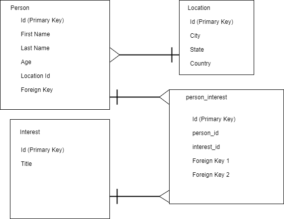

# Schema Design
---
Create a database schema that will represent People, their Location, and their Interests. This database is intended to be used to connect individuals who are in the same location and share interests.

## Steps
---
1. Create the three required tables (Person, Location, & Interest) along with any required join tables. Include the following listed columns in the designated tables, along with any additional columns required for join statements.
  * Person
    - Id (Primary Key)
    - First Name
    - Last Name
    - Age
  * Location
    - Id (Primary Key)
    - City
    - State
    - Country
  * Interest
    - Id (Primary Key)
    - Title
    
2. Set all Id fields to be autogenerated primary keys.
3. Add join columns and tables as necessary to ensure that:
  - A Person can have any number of interests
  - A Person must have one location
4. Write a SQL query that will find all Person entries that share a specified Interest and have the same specified Location (The Interest & Location can be hard coded during testing, this will be parameterized later).

---

**Schema Diagram**



---

**SQL Statement**

```
SELECT * FROM person
JOIN person_interest ON person.person_id=person_interest.person_id
JOIN location ON person.location_id=location.location_id
JOIN interest ON person_interest.interest_id=interest.interest_id
WHERE interest.title='Bird Watching' AND location.from_city='Portland';
```


|"person_id"|"first_name"|"last_name"|"age"|"location_id"|"person_interest_id"|"person_id-2"|"interest_id"|"location_id-2"|"from_city"|"from_state"|"from_country"|"interest_id-2"|"title"|
|---|---|---|---|---|---|---|---|---|---|---|---|---|---|
|3|"Cynthia"|"West"|35|3|6|3|8|3|"Portland"|"Oregon"|"USA"|8|"Bird Watching"|
|11|"Skylar"|"Chan"|38|3|18|11|8|3|"Portland"|"Oregon"|"USA"|8|"Bird Watching"|
|12|"Kayla"|"Stanley"|26|3|19|12|8|3|"Portland"|"Oregon"|"USA"|8|"Bird Watching"|
---

**Inserted Data**

```
-- Add data to location table
INSERT INTO location(from_city, from_state, from_country)
VALUES
	('Detroit', 'Michigan', 'USA'),
	('Dallas', 'Texas', 'USA'),
	('Portland', 'Oregon', 'USA'),
	('Orlando', 'Florida', 'USA'),
	('Little Rock', 'Arkansas', 'USA'),
	('Memphis', 'Tennessee', 'USA'),
  ('Orlando', 'Florida', 'USA'),
	('Phoenix', 'Arizona', 'USA'),
	('Los Angeles', 'California', 'USA'),
	('Chicago', 'Illinois', 'USA'),
	('Baton Rouge', 'Louisiana', 'USA'),
	('Lincoln', 'Nebraska', 'USA')
RETURNING *;

-- Add data to person table
INSERT INTO person(first_name, last_name, age, location_id)
VALUES
    ('Marty', 'Clements', 22, 1),
    ('Lorena', 'Sikes', 24, 2),
    ('Cynthia', 'West', 35, 3),
    ('Braydon', 'Foreman', 32, 2),
    ('Stuart', 'Harwood', 29, 8),
    ('Dexter', 'Banks', 28, 7),
    ('Beck', 'Jeffery', 42, 4),
    ('Lynn', 'Sanderson', 39, 5),
    ('Sarah', 'Heath', 33, 1),
    ('Katie', 'Knox', 27, 5),
    ('Skylar', 'Chan', 38, 3),
    ('Kayla', 'Stanley', 26, 3)
RETURNING *;

-- Add data to interest table
INSERT INTO interest(title)
VALUES
    ('Swimming'),
    ('Reading'),
    ('Hiking'),
    ('Biking'),
    ('Video Games'),
    ('Bowling'),
    ('Singing'),
    ('Bird Watching')
RETURNING *;

-- Add data to person_interest table
INSERT INTO person_interest(person_id, interest_id)
VALUES 
    (1, 1),
    (1, 4),
    (2, 5),
    (2, 2),
    (3, 7),
    (3, 8),
    (4, 1),
    (4, 4),
    (5, 6),
    (6, 1),
    (7, 1),
    (8, 3),
    (9, 2),
    (10, 3),
    (10, 1),
    (10, 2),
    (10, 6),
    (11, 8),
    (12, 8)
RETURNING *;

```
